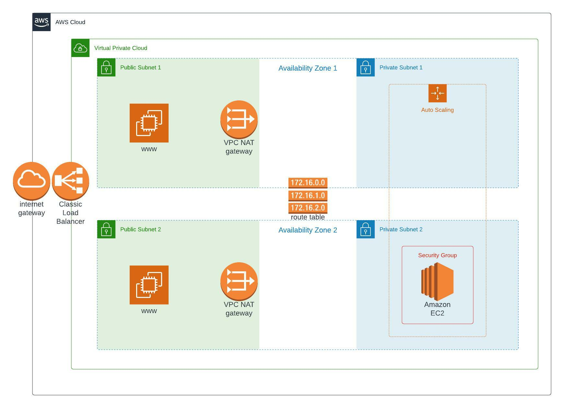

# Udagram Deployment
## This is a cloud formation script for a highly available Instagram-like website.
## The bucket contains the website files that will be loaded into the EC2 instances during the initialization.
## The YAML script consists 3 files: 
- network.yml >> the script of the network stack.
- servers.yml >> the script of the EC2 instances, load balancer, and security groups.
- bucket.yml >> contains the script that creates an empty bucket that will contain the website files.

## The following picture shows the architecture design of the infra:


## The steps to create all stacks:
1. Run the following command to create the bucket:
```
./scipts/create-bucket.sh
```
2. Wait until the status of the bucket stack to be CREATE_COMPLETE, then run:
```
./scripts/fill-bucket.sh
```
3. Run the following command to create the network stack:
```
./scipts/create-network.sh
```
4. Wait for the network stack status to be CREATE_COMPLETE, then run:
```
./scipts/create-servers.sh
```